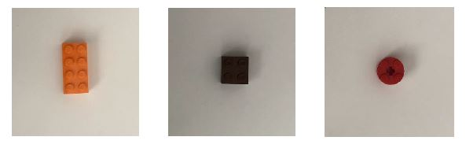
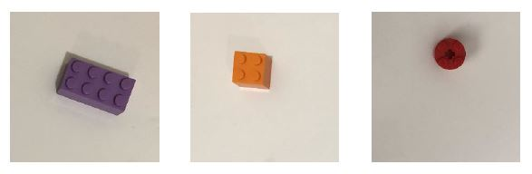

# Applied Machine Learning 
## Project – Stage 2 (Sorting Legos Using Engineered Features)

You have been hired by a company to develop machine learning algorithms for a sorting facility. The requirement is that the sorting device takes images of items on a conveyor belt, and then uses and machine learning algorithm to classify the items into classes. Then, the items get routed through different routes on the conveyor belt depending on their class.

For the sake of this project, you are given RGB images, and your focus will be on developing the classification algorithms. Also, for simplicity, it is assumed that items are Lego pieces of three different types with the following shapes (top view): Rectangles (2x4), squares (2x2), and circles (2x2). Examples are shown below:

The company tested your solution from stage 1, and requested an update. Namely, the company realized they have given you an idealized data set where the images are centered and oriented in a given direction. However, the items may appear in the image off-centre, and may have various orientations as shown below:

Your algorithm should be able to classify these three classes with different centering and orientations. To realize this, you need to extract/engineer features from the images, and to use these features to train and test a machine learning algorithm. The company requested that you use these features as the input of a 3-class classifier (Logistic regression, as in Lecture 5), and to use a maximum of 64 features per image.
