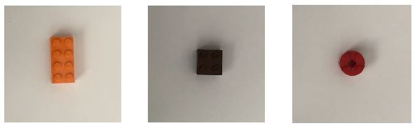

# Applied Machine Learning 
## Project – Stage 1 (Sorting Legos Using Raw Images)

You have been hired by a company to develop machine learning algorithms for a sorting facility. The requirement is that the sorting device takes images of items on a conveyor belt, and then uses and machine learning algorithm to classify the items into classes. Then, the items get routed through different routes on the conveyor belt depending on their class.

For the sake of this project, you are given RGB images, and your focus will be on developing the classification algorithms. Also, for simplicity, it is assumed that items are Lego pieces of three different types with the following shapes (top view): Rectangles (2x4), squares (2x2), and circles (2x2). Examples are shown below:

Your algorithm should be able to classify these three classes with an acceptable level of accuracy. It must use the raw image (grayscale conversion and scaling/cropping are acceptable) as an input to a single neuron classifier with < 𝟒𝟎𝟗𝟕 weights (trainable parameters). You are given two datasets to achieve this goal, each containing multiple images of each class. Use the dataset in the folder ‘training’ for training, and the one in the folder ‘testing’ for testing. Do not change the names of the folders or files.
